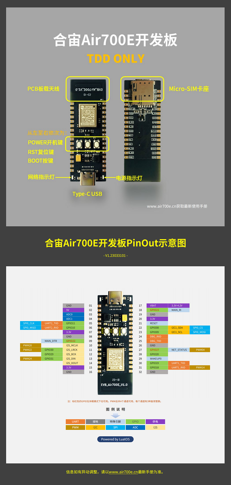

# sms-forward
sms forwarding with Air700e/Air780E

在Air700e(移动卡) 和 Air780E(联通卡) 测试过

无需推送服务器，通过SMTP转发短信至指定邮箱，需要SIM卡有流量。

## 配置

修改 inc/sms_forward_config.h中的邮箱配置

发送邮箱只测试过163邮箱，其他邮箱可能有所不同。

## 编译

需要CSDK
https://github.com/shuanglengyunji/luatos-soc-2022

`luatos-soc-2022> .\build.bat  sms_forward`

## 烧写
参考 [wiki](https://doc.openluat.com/wiki/37?wiki_page_id=4546)中的编译烧录流程。
按住BOOT键，然后按复位键，松开BOOT键，即可进入刷机模式，若设备 没开始请先长按PWR键开机

## 运行

上电按Power 1s运行。